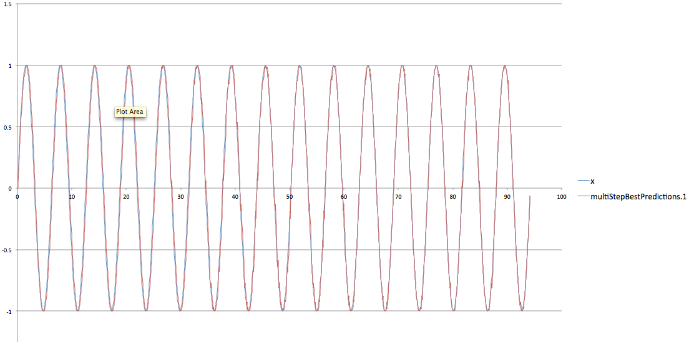
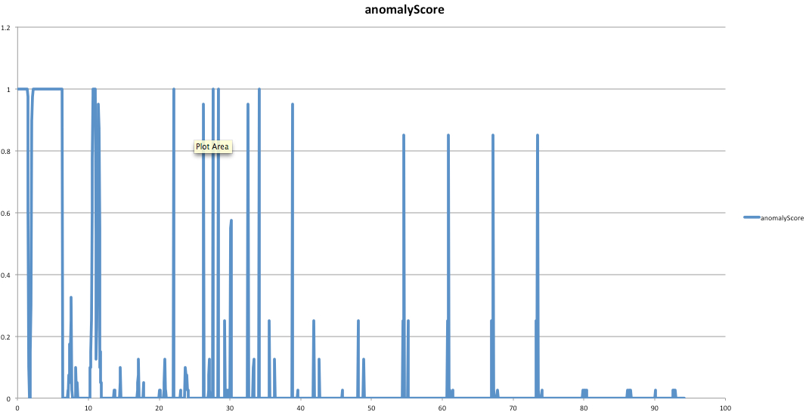

Introduction
============

This is an example demonstrating swarming for prediction and anomaly detection
models. The example also demonstrates using multiple fields. We assume you have
read the following page:

http://nupic.docs.numenta.org/0.7.0.dev0/guides/swarming/running.html

DISCLAIMER: we are using sine waves below to demonstrate some of the points
because this seems to be one of the most popular first tasks that people try.
Sine waves are actually not ideal for the CLA. It is a single continuously 
repeating pattern with no clear beginning and end. Please see an email
from Jeff Hawkin on this topic:

http://lists.numenta.org/pipermail/nupic_lists.numenta.org/2013-June/000327.html

Assumptions
===========

You have [NuPIC](http://github.com/numenta/nupic) installed and the `NUPIC` 
environment variable set to the repository path.

Data Files
==========

An artificially generated data file is contained in the `data` subdirectory. The
script `generate_data.py` was used to create the data file. The script generates
a sine wave plus some interesting additional fields to demonstrate how the CLA
handles multiple fields. Feel free to modify the script if you want to try
different variations.

The current script generates an x value (radians) plus the following fields.

metric1 contains sin(x).

metric2 contains sin(x(t-1)). In other words metric1 will be a perfect predictor
of metric2 at time t+1.

metric3 is metric 1 plus about 10% noise.

metric4 is random noise. At every step we choose a random number between -1 and
1.

metric5 is the value of metric4 from the *previous time step*. In other words,
metric4 is going to be a perfect predictor for metric5 at the next time step.
This is an interesting one because it discriminates temporal patterns from
spatial patterns. Most statistical tools would tell you that these two fields
are totally random. As we will see, the CLA can predict temporal correlations
even when there are NO spatial correlations. 


Prediction vs Anomaly Detection
===============================

The CLA basically does anomaly detection by doing prediction and looking for unpredicted situations.
All of the examples below use `inferenceType` = `TemporalAnomaly` in the JSON files. The CSV files contain 
predictions as well as anomaly scores.

You can also tell the CLA to just do pure prediction using `inferenceType` = `MultiStep`. In general 
this will give slightly better prediction results but you won't be able to do anomaly detection. 
(The reason for the improvement has to do with the way fields are fed to the CLA.) With MultiStep you can also ask the CLA to predict more than one step ahead. So, if you don't care about anomaly detection it is better to use `MultiStep` and your accuracy may be a bit better.

Now, on to the examples!!


Basic swarm with one field
==========================

Run a basic swarm using the following command:

```
%> $NUPIC/scripts/run_swarm.py basic_search_def.json --overwrite --maxWorkers 5
```

Note: The argument to maxWorkers controls the level of parallelism used
in the swarm. If you specify 5 it will launch 5 simultaneous processes. Usually
you want to set this to the number of cores you have on your system.

This command will take a few minutes to run and will produce a lot of output
(see http://nupic.docs.numenta.org/0.7.0.dev0/guides/swarming/running.html for an explanation of
the output). For now look for lines at the end which look something like this:

```
Best results on the optimization metric multiStepBestPredictions:multiStep:errorMetric='altMAPE':steps=[1]:window=1000:field=metric1 (maximize=False):
[17] Experiment _NupicModelInfo(jobID=1456, modelID=123986, status=completed, completionReason=eof, updateCounter=22, numRecords=1500) (modelParams|clParams|alpha_0.0807779076052.modelParams|tpParams|minThreshold_12.modelParams|tpParams|activationThreshold_16.modelParams|tpParams|pamLength_5.modelParams|sensorParams|encoders|metric1:n_443.modelParams|spParams|synPermInactiveDec_0.0142610042599):
  multiStepBestPredictions:multiStep:errorMetric='altMAPE':steps=[1]:window=1000:field=metric1:    1.88226653596
```

This shows the error from the best model discovered by the swarm. It tells us
that the MAPE error for the best model was about 1.88%. (Note: your results may
be slightly different due to some randomness in the swarm process.)

In addition it will produce a directory called `model_0` which contains
the parameters of the best CLA model. Now, run this model on the dataset to get
all the predictions:

```
%> $NUPIC/scripts/run_opf_experiment.py model_0
```

This will produce an output file called
`model_0/inference/DefaultTask.TemporalAnomaly.predictionLog.csv`. That file
contains a bunch of different columns (`run_opf_experiment.py` is a testing and
experimentation tool for running lots of datasets, so tends to contain a bunch
of information.)

You can plot the x column against the fields 'metric1' and
`multiStepBestPredictions.1` to show the actual vs predicted values.
The image basic_results.jpg shows an example of this:



If you zoom in near the end you can see the CLA is doing a decent job of predicting,
but does occasionally make mistakes:


You can also plot x against the field `anomalyScore` to see the anomaly score over time.
Here's an example:



Initially the anomaly score is very high but eventually it goes to near zero. 


Swarm exercise:
===============

Try modifying the above JSON file to get the swarm to predict metric3 instead of
metric1. Remember that metric3 is a sine wave with 10% noise added to it. 
(Note: you will need to modify the `includedFields` section to include metric3
instead of metric1, and modify `predictedField` to also include metric3) 
What happens to the error? 


Multiple fields example 1
=========================

The basic swarm above just looked at one of the fields in the dataset. The file 
`multi1_search_def.json` contains parameters that will tell the swarm to
searh all field combinations. In this case we will still predict the same
field, metric1, but it will attempt to use other field combinations to help improve the error.
The swarm can be started with the similar command but note that the process will
*take longer* as it has to try a bunch of combinations.

```
%> $NUPIC/scripts/run_swarm.py multi1_search_def.json --overwrite --maxWorkers 5
```

In the run I did, I got the following error:

```
Best results on the optimization metric multiStepBestPredictions:multiStep:errorMetric='altMAPE':steps=[1]:window=1000:field=metric1 (maximize=False):
[9] Experiment _NupicModelInfo(jobID=1458, modelID=124313, status=completed, completionReason=eof, updateCounter=22, numRecords=1500) (modelParams|clParams|alpha_0.1.modelParams|tpParams|minThreshold_12.modelParams|tpParams|activationThreshold_16.modelParams|tpParams|pamLength_5.modelParams|sensorParams|encoders|metric1:n_521.modelParams|spParams|synPermInactiveDec_0.005285):
  multiStepBestPredictions:multiStep:errorMetric='altMAPE':steps=[1]:window=1000:field=metric1:    2.16445919912
```

Previous:
> The end error was 0.89%, significantly better than before. This means at least
> one additional field helped.  But which one? At the end, look for a Field 
> Contributions JSON, that looks like this:

I'm not sure what happened here. -- Matt

```
Field Contributions:
{   u'metric1': 0.0,
    u'metric2': -11.202781024628713,
    u'metric3': -89.77508815971255,
    u'metric4': -115.27516774074387,
    u'metric5': -113.44391458481351}
```

Previous:
> We are predicting metric1. This JSON says that metric2 helped reduce the error
> by a relative value of 54%, i.e. it improved the error to 1.9% * (1 - 0.54). This 
> improvement makes sense - remember that metric2 was the one that actually predicted 
> the sine wave from theprevious time step! The other fields hurt performance and 
> therefore were not included in the final model.  

Note that it is very hard for the CLA to do perfectly on such a clean example.
It is a learning system that is memory based. It has no understanding of sine waves
or mathematical functions. However we often find that in real world noisy 
scenarios it can do very well.


Multiple fields exercise:
========================

Try modifying the above example to get the swarm to predict metric3 instead of
metric1. What happens to the error? Note that metric3 is a sine wave with 10% noise.


Multiple fields example 2:
=========================


We will do two more examples where we try to predict metric5. Remember that metric5
on its own is basically just noise.  The file `multi2_search_def.json` contains parameters 
that will tell the swarm to predict metric5. 

```
%> $NUPIC/scripts/run_swarm.py multi2_search_def.json --overwrite --maxWorkers 5
```

As you would expect for pure noise, the CLA could not predict it very well. The overall error
I got was 86%!

```
Best results on the optimization metric multiStepBestPredictions:multiStep:errorMetric='altMAPE':steps=[1]:window=1000:field=metric5 (maximize=False):
[11] Experiment _NupicModelInfo(jobID=1459, modelID=124597, status=completed, completionReason=eof, updateCounter=22, numRecords=1500) (modelParams|sensorParams|encoders|metric5:n_71.modelParams|clParams|alpha_0.00610213290723.modelParams|tpParams|minThreshold_10.modelParams|tpParams|activationThreshold_12.modelParams|tpParams|pamLength_1.modelParams|sensorParams|encoders|_classifierInput|n_28.modelParams|inferenceType_NontemporalMultiStep.modelParams|spParams|synPermInactiveDec_0.1):
  multiStepBestPredictions:multiStep:errorMetric='altMAPE':steps=[1]:window=1000:field=metric5:    85.0171086296
```

```
Field Contributions:
{   u'metric5': 0.0}
```


Multiple fields example 3:
==========================

Now let us predict metric5 but this time let's include all the fields:

```
%> $NUPIC/scripts/run_swarm.py multi3_search_def.json --overwrite --maxWorkers 5
```

Here are the results I got

```
Best results on the optimization metric multiStepBestPredictions:multiStep:errorMetric='altMAPE':steps=[1]:window=1000:field=metric5 (maximize=False):
[41] Experiment _NupicModelInfo(jobID=1460, modelID=124817, status=completed, completionReason=eof, updateCounter=22, numRecords=1500) (modelParams|sensorParams|encoders|metric4:n_296.modelParams|sensorParams|encoders|metric5:n_53.modelParams|clParams|alpha_0.055045.modelParams|tpParams|minThreshold_11.modelParams|tpParams|activationThreshold_14.modelParams|tpParams|pamLength_3.modelParams|spParams|synPermInactiveDec_0.055135):
  multiStepBestPredictions:multiStep:errorMetric='altMAPE':steps=[1]:window=1000:field=metric5:    4.32907961629
```

You can see that the error went down hugely, to 3.9%!  Here are the field contributions:

```
Field Contributions:
{   u'metric1': 2.375028729272684,
    u'metric2': 0.9204218934435886,
    u'metric3': 3.687943251991357,
    u'metric4': 94.83844188964719,
    u'metric5': 0.0}
```

As you can see, the CLA was able to learn the temporal correlation after adding
metric4 and doing so improved the error significantly. Although this is a very
artificial example, similar situations happen often in reality. Quite often
additional fields can help improve error, even if there are no spatial
correlations! This is a powerful aspect of streaming data that the CLA takes
advantage of.


FAQ
===

These are some questions people have asked me about the example:

1) In the JSON file, are we supposed to include ALL the signals in the
"includedFields"? For instance, if X is used to predict Y one step ahead, should
I include both X and Y in "includedFields"? And further include Y in the
"predictedField" as well? 

**Answer**: The swarm process searches over a number of fields to see which
combination can best predict the specified predicted field. The includedFields
are the fields you want to swarm process to search. This should be
over-inclusive as the swarm will figure out which ones are actually useful. For
anomaly detection you always need to include the predictedField (in your example
Y) in the includedFields list. The others are optional. If you include X and it
helps, it will be part of the final model. Some of the examples in there include
other fields, some don't.


2) For the above problem, does CLA use both X(k) and Y(k) to predict Y(k+1) or
does it use only X(k) to predict Y(k+1)? We specify the predicted field clearly
in the JSON file but since we also include both X and Y in the inputs, I am not
clear if the information from Y(k) is used or not.

**Answer**: The fields chosen depends on the statistics of the data. The swarm
process will determine which fields are useful in predicting the predictedField.
This is in the fieldContribution JSON; the fields that helped will be part of
the model. Let's say it chooses X and Y. Now, exactly which parts of X and Y are
used to predict Y again depends on specific statistics. The spatial pooler will
learn which combinations of X and Y occur together. You can think of this as a
type of clustering algorithm.


3) After I run CLA, in the inference folder, I see a
"DefaultTask.NontemporalMultiStep.predictionLog.csv". In this file, I see
Y.actual and Y.prediction both in float. Since I am doing one step ahead
prediction, does the log file automatically shift the Y.predicted data forward
by one step? ie, the value corresponding to Y.actual(k) is Y.prediction(k) or
Y.prediction(k+1)?

**Answer**: Yes, by default I believe OpfRunExperiment shifts the predictions so
they are lined up. So, if you are predicting 5 steps ahead, it will shift things
by 5 rows. This is just for convenience when plotting things in a spreadsheet.
When you use a CLA model in a real time scenario, obviously at time T it will
predict the field at time T+5.

4) For the above problem, how is the anomaly score calculated? 
    Is it using (Y.actual(k)-Y.prediction(k))? or 
    is it using bursting which depends on all dimensions of X? or 
    is it using bursting which depends on all dimensions of X and Y?

**Answer**: It's based on the intersection between the predicted columns (any
column that has a predicted cell in it will be a predicted column) and the
columns that actually become active in the next time step. In this example, the
maximum intersection is 40 (anomaly score of 0) and the minimum is 0 (anomaly
score of
1).


