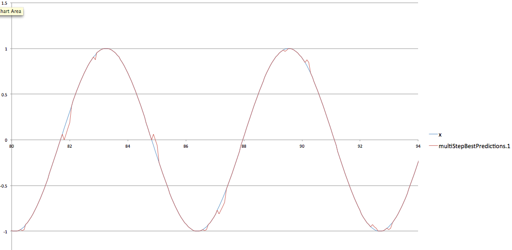

Introduction
============

This is an example demonstrating swarming for prediction and anomaly detection
models. The example also demonstrates using multiple fields. We assume you have
read the following wiki page:

https://github.com/numenta/nupic/wiki/Running-Swarms


Data Files
==========

An artificially generated data file is contained in the `data` subdirectory. The
script `generate_data.py` was used to create the data file. The script generates
a sine wave plus some interesting additional fields to demonstrate how the CLA
handles multiple fields. Feel free to modify the script if you want to try
different variations.

The current script generates an x value (radians) plus the following fields.

metric1 contains sin(x).

metric2 contains sin(x(t-1)). In other words metric1 will be a perfect predictor
of metric2 at time t+1.

metric3 is metric 1 plus about 10% noise.

metric4 is random noise. At every step we choose a random number between -1 and
1.

metric5 is the value of metric4 from the *previous time step*. In other words,
metric4 is going to be a perfect predictor for metric5 at the next time step.
This is an interesting one because it discriminates temporal patterns from
spatial patterns. Most statistical tools would tell you that these two fields
are totally random. As we will see, the CLA can predict temporal correlations
even when there are NO spatial correlations. 


Basic swarm with one field
==========================

Run a basic swarm using the following command:

```
%> run_swarm.py basic_search_def.json --overwrite --maxWorkers 5
```

Note: The argument to maxWorkers controls the level of parallelism used
in the swarm. If you specify 5 it will launch 5 simultaneous processes. Usually
you want to set this to the number of cores you have on your system.

This command will take a few minutes to run and will produce a lot of output
(see https://github.com/numenta/nupic/wiki/Running-Swarms for an explanation of
the output). For now look for lines at the end which look something like this:

```
Best results on the optimization metric multiStepBestPredictions:multiStep:errorMetric='altMAPE':steps=[1]:window=1000:field=metric1 (maximize=False):
[9] Experiment _GrokModelInfo(jobID=1160, modelID=23508, status=completed, completionReason=eof, updateCounter=22, numRecords=1500) (modelParams|clParams|alpha_0.0747751425553.modelParams|tpParams|minThreshold_11.modelParams|tpParams|activationThreshold_15.modelParams|tpParams|pamLength_4.modelParams|sensorParams|encoders|metric1:n_444.modelParams|spParams|synPermInactiveDec_0.0302633922224):
  multiStepBestPredictions:multiStep:errorMetric='altMAPE':steps=[1]:window=1000:field=metric1:    1.94054919265
```

This shows the error from the best model discovered by the swarm. It tells us
that the MAPE error for the best model was about 1.94%. (Note: your results may
be slightly different due to some randomness in the swarm process.)

In addition it will produce a directory called `model_0` which contains
the parameters of the best CLA model. Now, run this model on the dataset to get
all the predictions:

```
%> python $NTA/share/opf/bin/OpfRunExperiment.py model_0
```

This will produce an output file called
`model_0/inference/DefaultTask.TemporalAnomaly.predictionLog.csv`. That file
contains a bunch of different columns (`OpfRunExperiment.py` is a testing and
experimentation tool for running lots of datasets, so tends to contain a bunch
of information.)

You can plot the x column against the fields 'metric1' and
`multiStepBestPredictions.1` to show the actual vs predicted values.
The image basic_results.jpg shows an example of this:


If you zoom in near the end you can see the CLA is doing a decent job of predicting,
but does occasionally make mistakes:



You can also plot x against the field `anomalyScore` to see the anomaly score over time.
Here's an example:


Initially the anomaly score is very high but eventually it goes to near zero. 


Multiple fields example 1
=========================

The basic swarm above just looked at one of the fields in the dataset. The file 
`multi1_search_def.json` contains parameters that will tell the swarm to
searh the field combinations. In this case we will still predict the same
field, metric1, but it will try to other field combinations to help improve the error.
The swarm can be started with the similar command but note that the process will
take longer as it has to try a bunch of combinations.

```
%> run_swarm.py multi1_search_def.json --overwrite --maxWorkers 5
```

In the run I did, I got the following error:

```
Best results on the optimization metric multiStepBestPredictions:multiStep:errorMetric='altMAPE':steps=[1]:window=1000:field=metric1 (maximize=False):
[52] Experiment _GrokModelInfo(jobID=1161, modelID=23650, status=completed, completionReason=eof, updateCounter=22, numRecords=1500) (modelParams|clParams|alpha_0.0248715879513.modelParams|tpParams|minThreshold_10.modelParams|tpParams|activationThreshold_13.modelParams|tpParams|pamLength_2.modelParams|sensorParams|encoders|metric2:n_271.modelParams|sensorParams|encoders|metric1:n_392.modelParams|spParams|synPermInactiveDec_0.0727958344423):
  multiStepBestPredictions:multiStep:errorMetric='altMAPE':steps=[1]:window=1000:field=metric1:    0.886040768868
```

The end error was 0.89%, significantly better than before. This means at least one 
additional field helped.  But which one? At the end, look for a Field Contributions 
JSON, that looks like this:

```
Field Contributions:
{   u'metric1': 0.0,
    u'metric2': 54.62889798318686,
    u'metric3': -23.71223053273957,
    u'metric4': -91.68162623355796,
    u'metric5': -25.51553640787998}
```

We are predicting metric1. This JSON says that metric2 helped improve the error
by an additional 54%, i.e. 24% better than the previous 1.9%. This makes sense - 
remember that metric2 was the one that actually predicted the sine wave from the 
previous time step! The other fields hurt performance and therefore were not 
included in the final model.  

Note that it is very hard for the CLA to do perfectly on such a clean example.
It is a learning system that is memory based. It has no understanding of sine waves
or mathematical functions. However we often find that in real world noisy 
scenarios it can do very well.


Multiple fields example 2:
=========================


The file `test3_search_def.json` contains parameters that will tell the swarm to
searh all field combinations. In this case we will tell the CLA predict the
field, metric2. Now remember that metric2 is just metric1 from the previous
time step.

```
%> run_swarm.py test3_search_def.json --overwrite --maxWorkers 5
```

```
Best results on the optimization metric multiStepBestPredictions:multiStep:errorMetric='altMAPE':steps=[1]:window=1000:field=metric2 (maximize=False):
[46] Experiment _GrokModelInfo(jobID=1038, modelID=3566, status=completed, completionReason=eof, updateCounter=22, numRecords=1500) (modelParams|clParams|alpha_0.0351293137955.modelParams|tpParams|minThreshold_10.modelParams|tpParams|activationThreshold_13.modelParams|tpParams|pamLength_2.modelParams|sensorParams|encoders|metric2:n_500.modelParams|sensorParams|encoders|metric1:n_145.modelParams|spParams|synPermInactiveDec_0.0771153642407):
  multiStepBestPredictions:multiStep:errorMetric='altMAPE':steps=[1]:window=1000:field=metric2:    0.913722715504
```


Field Contributions:
{   u'metric1': 58.04834257521399,
    u'metric2': 0.0,
    u'metric3': -8.9984071264884,
    u'metric4': -169.10294900144498,
    u'metric5': -269.60989468137325}
    


Multiple fields example 3:

Predict metric 5. This is a case where there is complete noise but strong
temporal correlation.

```
%> run_swarm.py test4_search_def.json --overwrite --maxWorkers 5
```

Field Contributions:
{   u'metric1': -2.3055948655605376,
    u'metric2': -0.5331590138027453,
    u'metric3': -2.4612375287911568,
    u'metric4': 91.73137670780368,
    u'metric5': 0.0}

Best results on the optimization metric multiStepBestPredictions:multiStep:errorMetric='altMAPE':steps=[1]:window=1000:field=metric5 (maximize=False):
[53] Experiment _GrokModelInfo(jobID=1039, modelID=3800, status=completed, completionReason=eof, updateCounter=22, numRecords=1500) (modelParams|sensorParams|encoders|metric4:n_104.modelParams|sensorParams|encoders|metric5:n_193.modelParams|clParams|alpha_0.0001.modelParams|tpParams|minThreshold_9.modelParams|tpParams|activationThreshold_12.modelParams|tpParams|pamLength_2.modelParams|spParams|synPermInactiveDec_0.1):
  multiStepBestPredictions:multiStep:errorMetric='altMAPE':steps=[1]:window=1000:field=metric5:    6.96976944652
